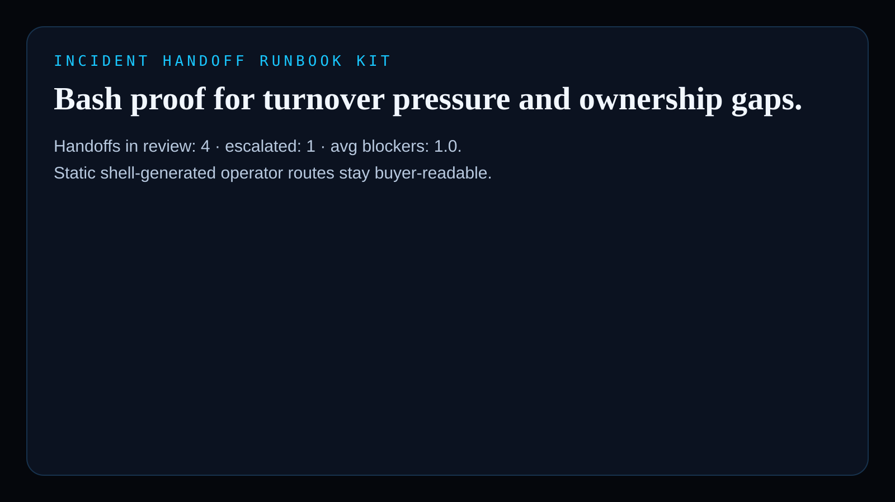
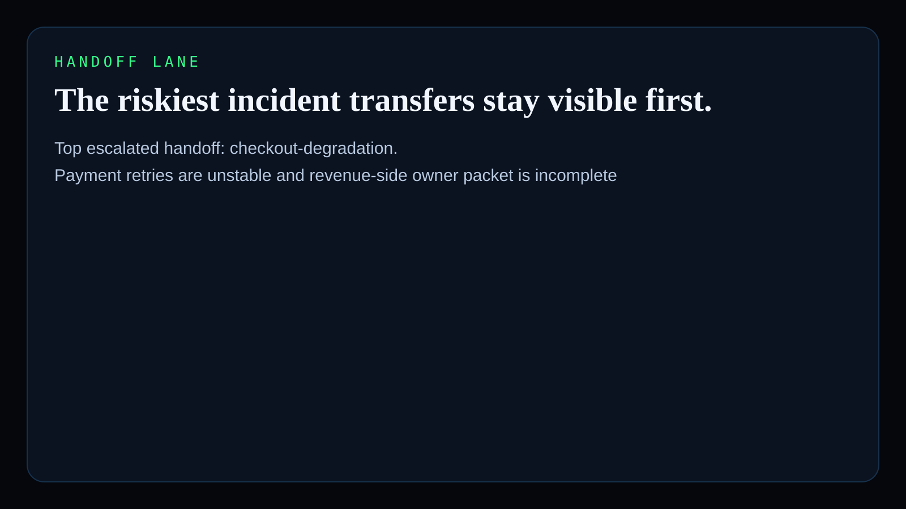
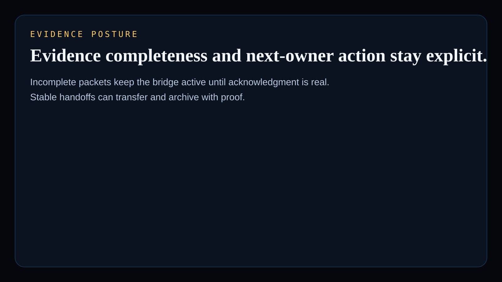
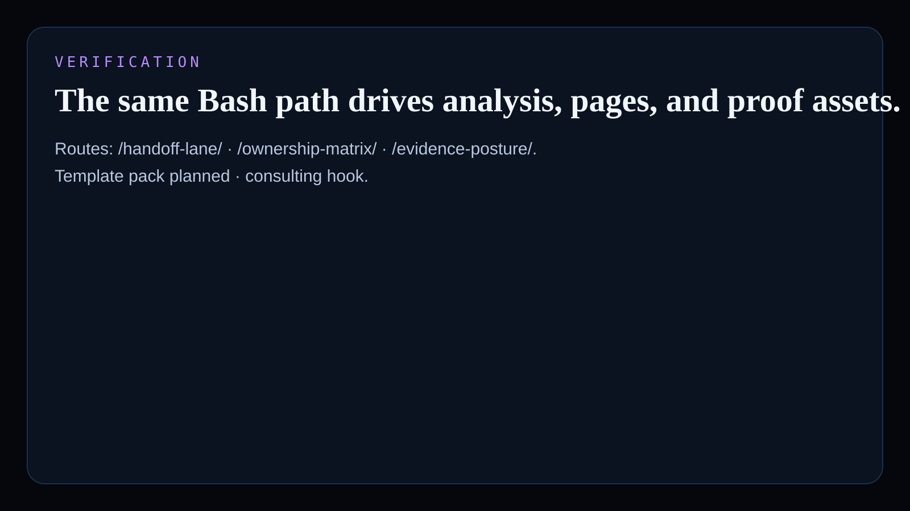

# incident-handoff-runbook-kit

Bash-native operator surface for SRE, Platform, Security, Support, and Revenue teams reviewing incident owner handoff pressure, evidence completeness, SLA drift, and next-step routing.

## What it shows

- real `Shell / Bash` added to the public Kinetic Gain language atlas with a second distinct primitive
- incident-handoff decisioning that comes from shell analysis, not a mocked dashboard
- monetizable runbook kits, handoff templates, and embedded incident-governance consulting hooks

## Screenshots






## Routes

- `/`
- `/handoff-lane/`
- `/ownership-matrix/`
- `/evidence-posture/`
- `/verification/`
- `/docs/`

## Local development

```powershell
bash scripts/run_demo.sh
bash scripts/generate_site.sh
```

## Validation

```powershell
bash test/runtests.sh
bash scripts/smoke_check.sh
bash scripts/render_readme_assets.sh
```

## Why this matters

Kinetic Gain Embedded tie-back:

This repo proves Kinetic Gain can ship buyer-readable incident turnover and accountability logic directly from Bash. The language-atlas signal is real: analyze handoff pressure, publish operator routes, and keep the same surface usable for runbook kits and embedded incident-response work.

## Commercial path

- `Template pack planned`
- `Consulting hook`

This can ladder into incident handoff packs, war-room turnover checklists, evidence routing kits, and embedded incident-governance work for platform and security teams.

---

Part of the [Kinetic Gain operator portfolio](https://kineticgain.com/) · docs: [suite.kineticgain.com](https://suite.kineticgain.com/) · live: [runbook.kineticgain.com](https://runbook.kineticgain.com/)
